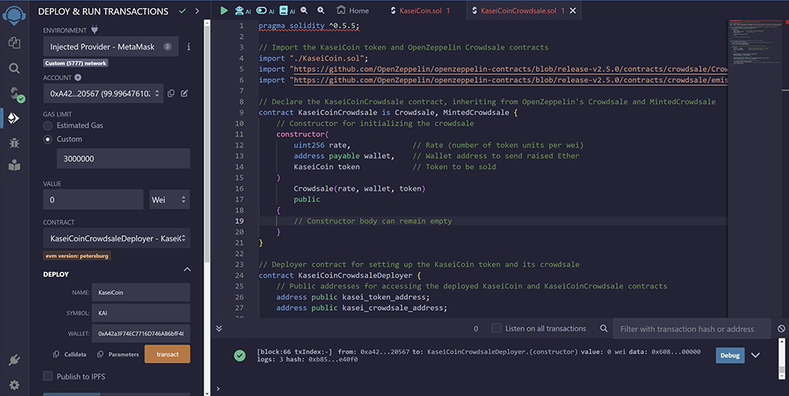
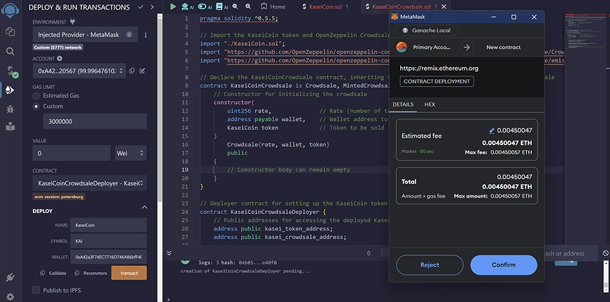
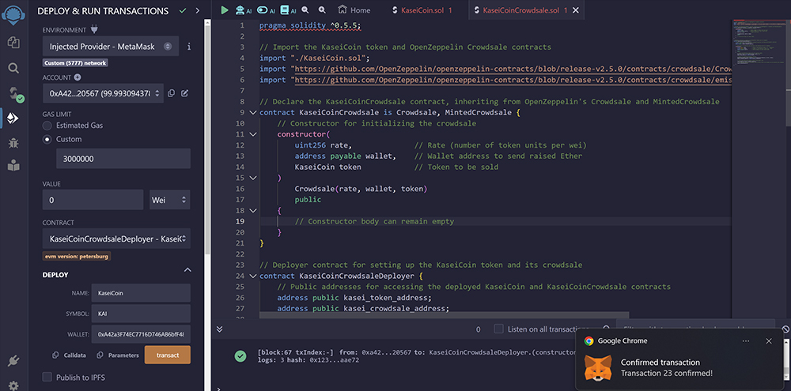

# KaseiCoin & KaseiCoinCrowdsale

## Overview

This repository contains the Solidity smart contracts for KaseiCoin, a cryptocurrency designed for use in a hypothetical colonization of Mars, and its associated crowdsale for initial distribution. KaseiCoin utilizes ERC-20 standards with extended functionality for minting capabilities, supporting a crowdsale mechanism directly through Ethereum blockchain technology.

## Contract Descriptions

### KaseiCoin

KaseiCoin is a fully compliant ERC-20 token with additional minting functionality, allowing the crowdsale contract to mint new tokens when purchases are made. It is based on the OpenZeppelin library, which is known for its secure and community-vetted smart contracts.

#### Features
- **ERC-20 Compliance**: Ensures compatibility with the broad Ethereum ecosystem, including wallets and other contracts.
- **Mintable**: New tokens can be created by designated parties, in this case, the crowdsale contract, during the initial sale period.

#### KaseiCoin.sol
The KaseiCoin.sol code snippet is a Solidity smart contract that creates an ERC-20 token named KaseiCoin with additional functionality for minting new tokens. This code utilizes OpenZeppelin, a library known for providing secure, community-audited, reusable components for Ethereum smart contract development.
```solidity
pragma solidity ^0.5.5;

// Import the necessary OpenZeppelin contracts
import "https://github.com/OpenZeppelin/openzeppelin-contracts/blob/release-v2.5.0/contracts/token/ERC20/ERC20.sol";
import "https://github.com/OpenZeppelin/openzeppelin-contracts/blob/release-v2.5.0/contracts/token/ERC20/ERC20Detailed.sol";
import "https://github.com/OpenZeppelin/openzeppelin-contracts/blob/release-v2.5.0/contracts/token/ERC20/ERC20Mintable.sol";

// Declare the KaseiCoin contract
contract KaseiCoin is ERC20, ERC20Detailed, ERC20Mintable {
    // Constructor for the KaseiCoin token
    constructor(
        string memory name,    // Name of the token, e.g., "KaseiCoin"
        string memory symbol,  // Symbol of the token, e.g., "KAI"
        uint initial_supply    // Initial supply of tokens, if any
    )
        ERC20Detailed(name, symbol, 18)  // Set the token details, including 18 decimal places
        public
    {
        // Constructor can stay empty as minting is controlled elsewhere
    }
}
```
#### KaseiCoinCrowsale.sol
The KaseiCoinCrowdsale.sol contract represents the implementation of a crowdsale for the KaseiCoin, utilizing functionalities from the OpenZeppelin library. This crowdsale contract is designed to manage the entire process of selling KaseiCoin tokens in exchange for Ethereum (ETH), incorporating best practices for security and efficiency.
```solidity
pragma solidity ^0.5.5;

// Import the KaseiCoin token and OpenZeppelin Crowdsale contracts
import "./KaseiCoin.sol";
import "https://github.com/OpenZeppelin/openzeppelin-contracts/blob/release-v2.5.0/contracts/crowdsale/Crowdsale.sol";
import "https://github.com/OpenZeppelin/openzeppelin-contracts/blob/release-v2.5.0/contracts/crowdsale/emission/MintedCrowdsale.sol";

// Declare the KaseiCoinCrowdsale contract, inheriting from OpenZeppelin's Crowdsale and MintedCrowdsale
contract KaseiCoinCrowdsale is Crowdsale, MintedCrowdsale {
    // Constructor for initializing the crowdsale
    constructor(
        uint256 rate,              // Rate (number of token units per wei)
        address payable wallet,    // Wallet address to send raised Ether
        KaseiCoin token            // Token to be sold
    )
        Crowdsale(rate, wallet, token)
        public
    {
        // Constructor body can remain empty
    }
}

// Deployer contract for setting up the KaseiCoin token and its crowdsale
contract KaseiCoinCrowdsaleDeployer {
    // Public addresses for accessing the deployed KaseiCoin and KaseiCoinCrowdsale contracts
    address public kasei_token_address;
    address public kasei_crowdsale_address;

    // Constructor for deploying and setting up the KaseiCoin and its crowdsale
    constructor(
        string memory name,            // Name of the KaseiCoin token, e.g., "KaseiCoin"
        string memory symbol,          // Symbol of the KaseiCoin token, e.g., "KAI"
        address payable wallet         // Wallet address to send raised funds
    )
        public
    {
        // Deploy the KaseiCoin token with zero initial supply
        KaseiCoin token = new KaseiCoin(name, symbol, 0);
        kasei_token_address = address(token);

        // Deploy the KaseiCoinCrowdsale contract
        KaseiCoinCrowdsale kasei_crowdsale = new KaseiCoinCrowdsale(1, wallet, token);
        kasei_crowdsale_address = address(kasei_crowdsale);

        // Grant the KaseiCoinCrowdsale contract the minter role
        token.addMinter(kasei_crowdsale_address);
        // The deployer renounces its minter role to ensure that no new tokens can be minted by this deployer
        token.renounceMinter();
    }
}
```
Integration of KaseiCoin and KaseiCoinCrowdsale

The `KaseiCoin.sol` and `KaseiCoinCrowdsale.sol` contracts collectively provide a robust framework for launching a new cryptocurrency and facilitating its initial distribution through a crowdsale. These contracts are essential for understanding the interplay between token creation and distribution mechanisms on the Ethereum blockchain.

### Seamless Integration of Token Creation and Distribution

- **Token Creation (`KaseiCoin.sol`):**
  - The `KaseiCoin` contract sets up the fundamental attributes of the new ERC-20 token, including minting capabilities, which allow for the dynamic issuance of tokens. It leverages OpenZeppelin's secure and compliant modules to ensure the token meets industry standards.
  
- **Token Distribution (`KaseiCoinCrowdsale.sol`):**
  - This contract manages the actual sale of the KaseiCoin to participants, handling the exchange of Ether for KaseiCoin based on a pre-defined rate. It builds on OpenZeppelin’s `Crowdsale` and `MintedCrowdsale` functionalities to provide basic sale mechanisms and on-the-fly minting.

### Why This Is an Excellent First Concept to Understand

- **ERC-20 Standards:**
  - Through `KaseiCoin`, developers can understand the implementation of ERC-20 standards, essential for ensuring token interoperability within the Ethereum ecosystem.

- **Crowdsale Dynamics:**
  - The `KaseiCoinCrowdsale` contract offers insights into the dynamics of token sales and ICOs, crucial for anyone interested in blockchain-based fundraising.

- **Integration and Modular Design:**
  - These contracts demonstrate effective modular design, using OpenZeppelin's secure building blocks to create complex functionalities, which is a best practice in smart contract development.

- **Smart Contract Security:**
  - The use of audited contracts from OpenZeppelin highlights the importance of security in blockchain development, an essential factor given the immutable and public nature of smart contracts.

- **Practical Application in Fundraising:**
  - Understanding these contracts helps grasp the mechanics of decentralized fundraising and financial operations, relevant in the emerging field of decentralized finance (DeFi).

`KaseiCoin.sol` and `KaseiCoinCrowdsale.sol` not only showcase the technical implementation of blockchain technology but also exemplify best practices in the development and deployment of smart contracts for real-world applications.




